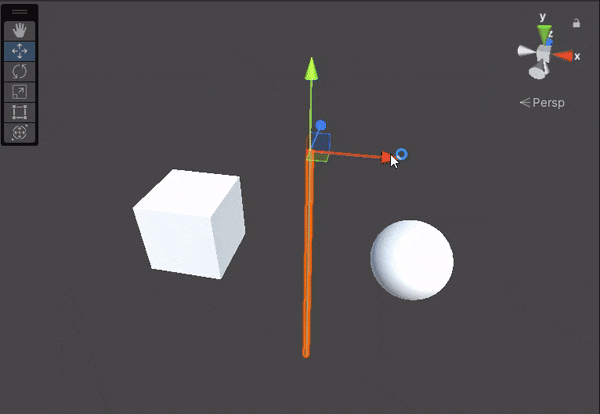
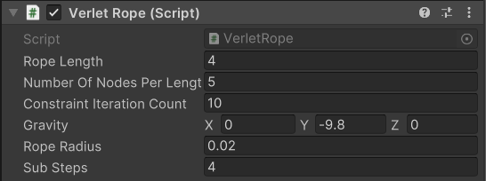
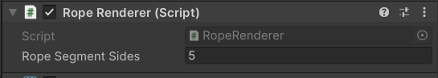

# Rope Physics Using Verlet Integration in Unity

## What is Verlet Integration?
[Verlet integration](https://en.wikipedia.org/wiki/Verlet_integration) is a numerical method used to calculate the trajectory of particles in molecular dynamics. But it's widely used in computer graphics and software simulations to simulate physical phenomena and visual effects.

In each time step, it calculates the position of the particle in the next time step using current position, previous position and its accelaration. Then it applies constraints (if there's any) to maintain the right position of each particle.

## How Is It Used to Simulate a Rope?
We see a rope as a string of particles/nodes connected to each other with a fixed distance from each other. By running the Verlet integration for each node in the rope, we can simualte its physics with good accuracy.

We apply the constraint of nodes having the same distance from each other in each frame, and resolve collisions.

I also render a cylender-like mesh for the rope, which is generated procedurally in each timestep.

## How to Use This Project?

1. Clone this repository.
2. Open the project in Unity 2022.3.16 (Other versions are not tested but they might work).
3. Open `SampleScene` scene in the scenes folder.
4. Press play. After pressing Play, the rope appears.
5. Move the rope around in the scene view and see how it goes (I haven't implemented any control for it to use in the game view. Sorry :( )

In the `Prefabs` folder you can find the `Rope` prefab which has two components.

The first is the `Verlet Rope` component. It has some fields:

* **Rope Length:** The length of the rope.
* **Number of Nodes per Length:** How many nodes are on 1 unit of length of the rope. the more the nodes are, the more accurate the simualtion is, but also computationally heavier.
* **Constraint Iteration Count:** How many times the constraints are applied in each timestep. The more the iterations, the stiffer the rope becomes.
* **Gravity:** The gravity vector.
* **Rope Radius:** The radius of the rope.
* **Substeps:** The number of iterations simulation is run in each timestep. Improves accuracy.

The other component is the `Rope Renderer`. It has only one field:

* **Rope Segment Sides:** The number of sides the rope will have when the 3D mesh is rendered.

